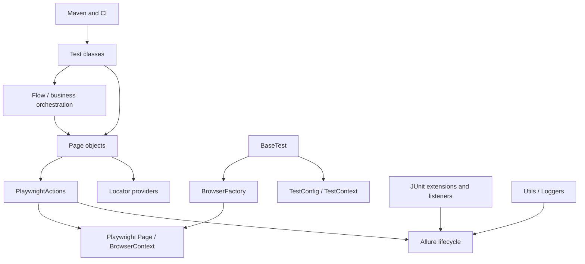

# Architecture Analysis

## Model

## Patterns actually present

| Pattern | Evidence and intent | Required? |
|---|---|---|
| Page Object | `BasePage`, `LoginPage`, `ProductPage` expose named UI operations and assertions | Yes |
| Page + Flow facade | `AuthenticationFlow` composes login and product operations into a business action | Yes for reusable multi-page behavior |
| Factory | `BrowserFactory` selects browser type and creates contexts/pages | Yes; browser creation must stay centralized |
| Template method/base fixture | `BaseTest` supplies setup, teardown, shared objects, and lifecycle | Yes for current test contract |
| Adapter/wrapper | `PlaywrightActions` wraps low-level Playwright operations; locator providers wrap selector creation | Yes conceptually |
| Observer/listener | JUnit and Allure lifecycle listeners decorate execution, screenshots, labels, and reports | Yes conceptually; API adapts |
| Thread-local context | `BaseTest`, `TestContext`, `BrowserFactory`, and listener state isolate metadata and some objects | Current implementation; preserve isolation, not necessarily duplication |

There is no confirmed dependency-injection container, service layer, builder, or
registry. Objects are lazily created by `BaseTest` and passed into constructors.
`BrowserFactory` has static Playwright/Browser state, so it is factory plus shared
resource holder rather than a clean per-thread factory.

## Dependency rules

Tests may use flows, pages, data loaders, and inherited fixture state. Flows may
compose pages, but should not own browser startup. Pages may use `BasePage`,
locators, actions, logging, and assertions about UI state. Locator providers return
selectors and should not navigate or assert. Browser/config/report utilities are
framework infrastructure. Pages and flows must not create a second browser or read
CI-specific settings directly.

## Object and data flow

`BaseTest.testSetup(TestInfo)` initializes metadata, lazily creates a
`BrowserFactory`, launches the configured browser, creates the default context and
page, wraps them in `PlaywrightActions`, then constructs pages and flows. A test
loads resource properties through `TestDataLoader`, calls a flow or page, and
asserts through page methods. `TestContext` supplies names and counters to artifact
paths and Allure processing.

## Classification

**Confirmed:** Page -> Flow -> Test is documented in README and implemented by
`AuthenticationFlow` and `LoginTest`. **Strongly inferred:** the flow boundary is
intended to reduce test/UI coupling because the README explicitly states that
business behavior belongs in Flow. **Unknown:** whether future projects require
additional service/API layers; none exist in this repository.
