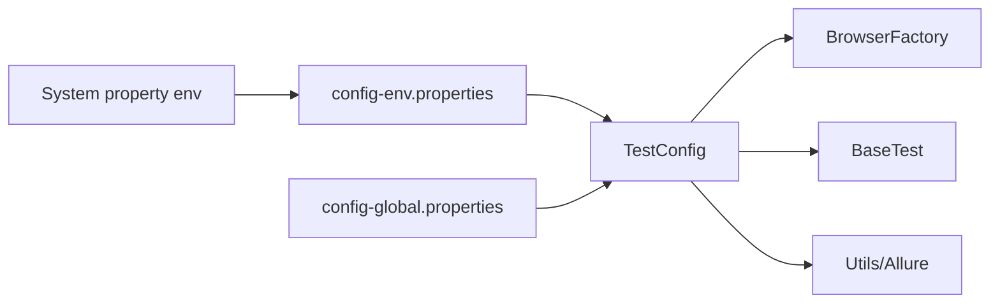

# Configuration Specification

## Sources and precedence

`TestConfig` reads `System.getProperty("env", "test")`, then loads
`config-<env>.properties` and `config-global.properties` from the classpath.
Environment properties win; global properties are fallback. Missing keys return
`null` unless the caller supplies a default. The static initializer prints a stack
trace on load failure, so missing files are not fail-fast.

The reference keys are `base.url`, `browser`, `headless`, `timeout`,
`resultsDirectory`, `allureResultsBaseDir`, and `takeScreenshotByPlaywright`.
`pom.xml` supplies `test.groups`, Allure paths, and OS-specific Allure command
selection. `env` is the only confirmed runtime environment switch.

Credentials are currently in test-resource properties (and example environment
files), not a secret manager. Preserve externalized data but adapt secret handling
for real deployments. Timeout is configured as a property but action methods also
contain literal wait values; this is a known limitation.
