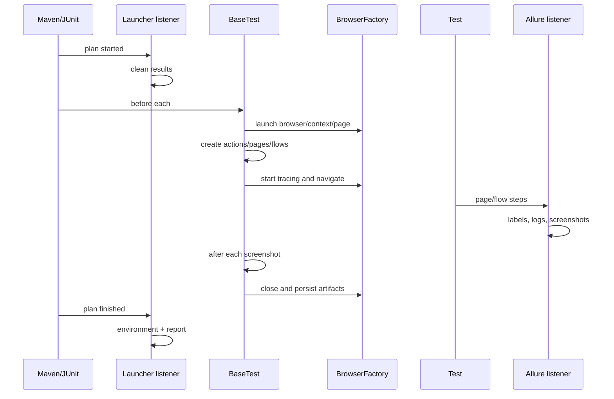

# Execution Lifecycle

## Normal sequence

1. Maven Surefire starts the JUnit Platform and loads ServiceLoader listeners.
2. `LauncherSessionListener.testPlanExecutionStarted` cleans Allure results once.
3. A test class is instantiated with `PER_CLASS` lifecycle and extensions are
   applied (`AllureJunit5`, `AllureStepScreenshotListener`).
4. `BaseTest.@BeforeAll` repeats the cleanup call safely through an AtomicBoolean.
5. `BaseTest.@BeforeEach` initializes browser/page objects once per test instance,
   resolves `REQ` and `SUITE` by reflection when present, creates result folders,
   starts tracing, and navigates to the configured base URL.
6. Test data setup runs as another `@BeforeEach` (in `LoginTest`), then the test
   invokes a flow/page.
7. Page and flow methods create Allure steps and log through `Loggers`.
8. The Allure listener observes steps, attaches tags, and takes Playwright
   screenshots around page/flow steps.
9. `@AfterEach` takes a desktop screenshot and switches to the default page.
10. `@AfterAll` closes pages/contexts, stops tracing, moves video paths, closes
    Browser and Playwright, and clears selected ThreadLocals.
11. Plan completion writes `environment.properties` and invokes the Maven Allure
    report generation helper.

## Failure sequence

Exceptions from navigation or assertions propagate to JUnit. The Allure listener
marks/stops the active log step as failed and may capture a screenshot before step
closure. Teardown still runs under JUnit lifecycle; its screenshot/logging methods
currently log failures rather than rethrowing them. Maven is configured with
`testFailureIgnore=true`, so CI performs a second, explicit Surefire XML failure
check and exits non-zero.

## Runner-independent intent

The invariant is per-test isolation, deterministic setup/cleanup, metadata before
artifact creation, and report finalization after the plan. `@BeforeEach`,
`@AfterEach`, `@BeforeAll`, `@AfterAll`, TestInfo, and JUnit listener interfaces are
runner-specific adapters; TestNG equivalents must preserve those responsibilities.
