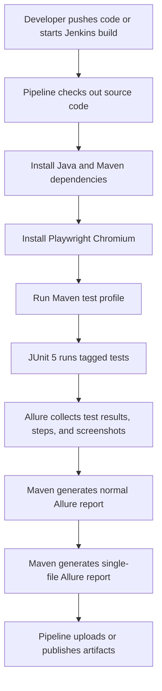

# CI/CD Architecture

This document explains how the automation pipeline is structured and how the main pieces work together.

## Big Picture

This project is a Playwright Java test framework. The CI/CD setup does not deploy an application. Instead, it runs automated UI tests and publishes test evidence:

- JUnit/Surefire test result XML
- Allure raw results
- Allure HTML report
- Single-file Allure HTML report
- Screenshot attachments from Allure

The main flow is:



## Important Files

| File | Purpose |
| --- | --- |
| `pom.xml` | Defines dependencies, Maven plugins, Allure generation, and smoke/regression profiles. |
| `.github/workflows/ci.yml` | GitHub Actions pipeline with separate smoke and regression jobs. |
| `Jenkinsfile` | Jenkins pipeline with selectable test group presets and optional custom tag expressions. |
| `src/test/java/annotations/*` | Custom annotations such as `@SmokeRegressionTest` and `@RegressionTest`. |
| `src/test/java/base/AllureStepScreenshotListener.java` | Adds screenshots to each Allure step. |

## Maven Is The Center

Both GitHub Actions and Jenkins delegate the real work to Maven.

That is deliberate. It means the command is consistent everywhere:

```bash
mvn clean test -Psmoke
mvn clean test -Pregression
```

The pipeline tools are mostly wrappers around these commands.

This is the clean mental model:

```text
GitHub Actions/Jenkins = orchestration
Maven = build and test execution
JUnit 5 = test discovery and filtering
Playwright = browser automation
Allure = reporting
```

## Smoke And Regression Split

Smoke tests are meant to answer:

> Is the most important flow still basically alive?

Regression tests are meant to answer:

> Did any broader behavior break?

The project uses JUnit 5 tags, but wraps them in custom annotations so tests stay readable:

```java
@SmokeRegressionTest(description = "Verify user can login successfully")
void userCanLoginSuccessfully() {
    ...
}

@RegressionTest(description = "Verify user cannot login with invalid credentials")
void userCannotLoginWithInvalidCredentials() {
    ...
}
```

Internally:

- `@SmokeRegressionTest` means `@Test + @Tag("smoke") + @Tag("regression")`
- `@RegressionTest` means `@Test + @Tag("regression")`
- Allure description is set by `AllureDescriptionExtension`

Maven profiles in `pom.xml` map those tags into executable suites:

```bash
mvn clean test -Psmoke
mvn clean test -Pregression
```

## Report Output

After a test run, Maven creates these useful paths:

| Path | Meaning |
| --- | --- |
| `target/allure-results` | Raw Allure JSON and attachment files. |
| `target/site/allure-report` | Normal Allure HTML report folder. |
| `target/site/allure-report/data/attachments` | Screenshot files inside the generated Allure report. |
| `target/allure-single/index.html` | Single-file Allure report, easiest to share. |
| `target/surefire-reports` | JUnit/Surefire XML and text reports. |

The normal Allure report is a folder. It needs all its assets to work.

The single-file report is one HTML file. It is easier to share, but it can become large because screenshots are embedded.

## Why The Pipeline Has A Manual Failure Check

In `pom.xml`, Surefire has:

```xml
<testFailureIgnore>true</testFailureIgnore>
```

This is intentional. If a test fails, Maven should continue far enough to generate Allure reports. Without this, a failed test can stop the build before the report is created.

The tradeoff is that Maven can say `BUILD SUCCESS` even when tests failed. To fix that, GitHub Actions reads the Surefire XML after report generation and fails the job if it sees failures or errors.

That gives both outcomes:

- Report is still generated.
- CI status still becomes failed when tests fail.

## Debugging Checklist

If a pipeline fails, check in this order:

1. Did checkout happen?
2. Did Java setup complete?
3. Did Playwright Chromium install?
4. Did `mvn clean test -Psmoke` or `-Pregression` run?
5. Did Surefire XML show failures or errors?
6. Was `target/allure-single/index.html` generated?
7. Were screenshots generated under `target/site/allure-report/data/attachments`?

Most failures will be in step 3 or step 4.

Playwright/browser installation problems usually show up before tests run. Locator, timeout, and assertion problems show up inside Surefire and Allure.
